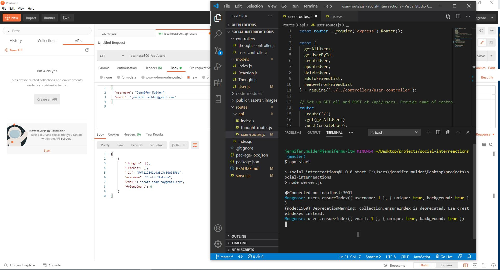

# social-interreactions

# Tutorial
Pt1: https://drive.google.com/file/d/1lEX6_SUobKly-0uosXmvQ3xIMkcDTlsh/view
Pt2: https://drive.google.com/file/d/1m8AndiU6tEx1lD7aYNzxPGlUJB5cD-IP/view

## Purpose
To create an API for a social media network that can handle large amounts of unstructured data, utilizing a NoSQL database.

## Features
When the user starts the server, they can view all users and all thoughts in a JSON format. The user can also view users and thoughts by a specified ID. The user can create new users/ thoughts, update users/thoughts, and remove users/thoughts. Each user can have a friend added or removed and each thought can have a reaction added or removed.

## Built With
* JavaScript
* Node JS 
* NoSQL - MongoDB
* Express
* Mongoose
* Moment

## API testing
Postman

## Usage
To run program: node server

## Project Status
The e-commerce application is compliant with defined acceptance criteria

## Contribution
Created by Jennifer Mulder

